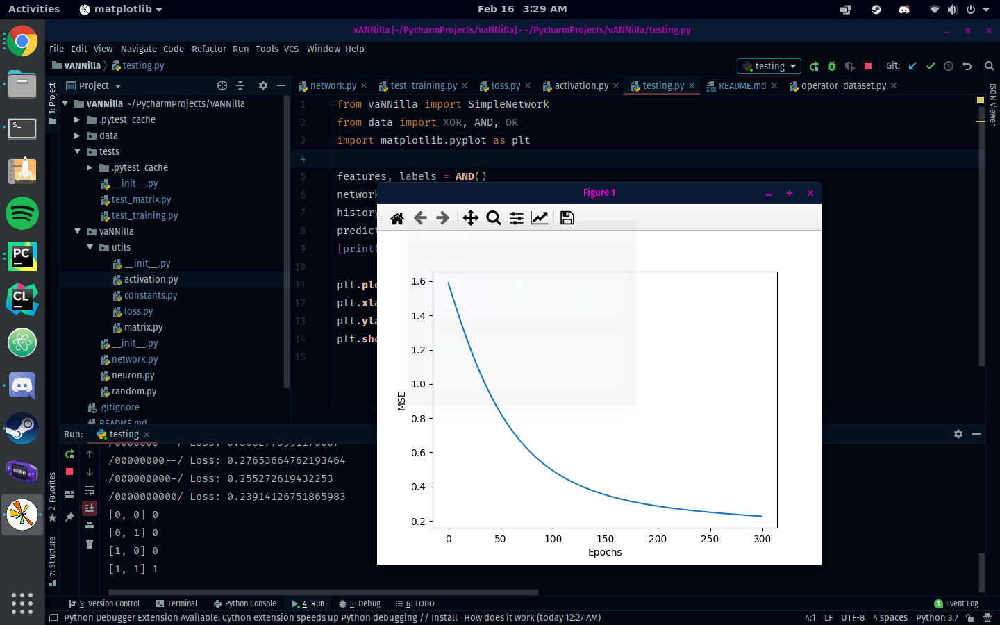
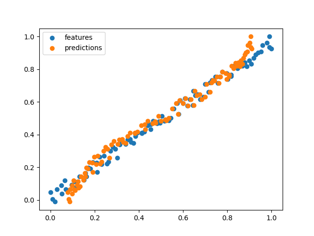

# vANNilla
An Artificial Neural Network written in Vanilla Python

No external packages

No stdlib packages

Just lists, floats, and classes B)

# Notable Moments
### First time I got the loss to minimize

### First successful linear regression

